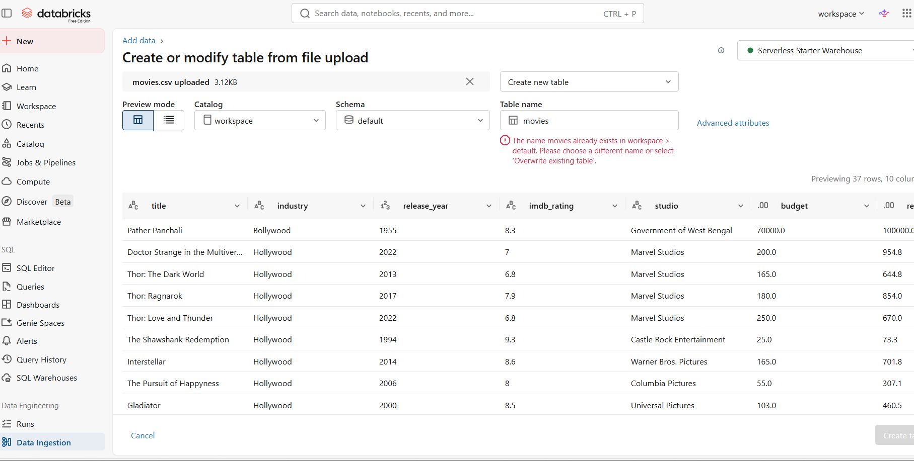
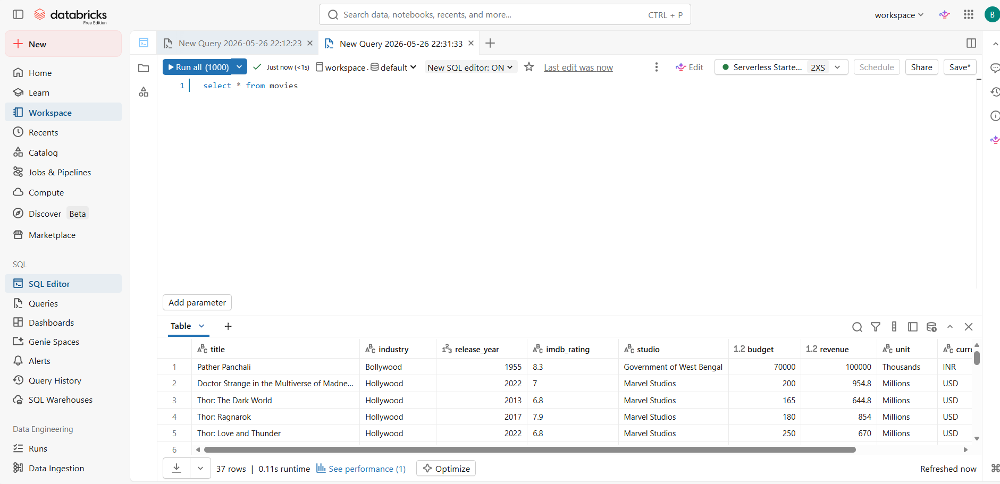

# Apache Spark and Hadoop

hadoop was introduced for distributed computing, but had serveral issue like disk heavy and slow.and later spark is introduced by apmlab

spark is distributed computing, much faster than hadoop and in-memory distributed computing.

To run a spark we have two options,

- self hosted - download spark / install via pipy / install via Docker
means we have do manage spark clusters and monitoring and scale up/down of clusters

- managed service - databricks is managed service means all spark/infra management hanldled by databricks 

NOTE: The databricks is found by the people who found the spark , they are know as Berkley mafia.

# Databricks free edition

## first step 

1.setup done in databrics free edition, in upload insetion file uploaded movies.csv file as table in workspace.default
2.Queried table as sql

