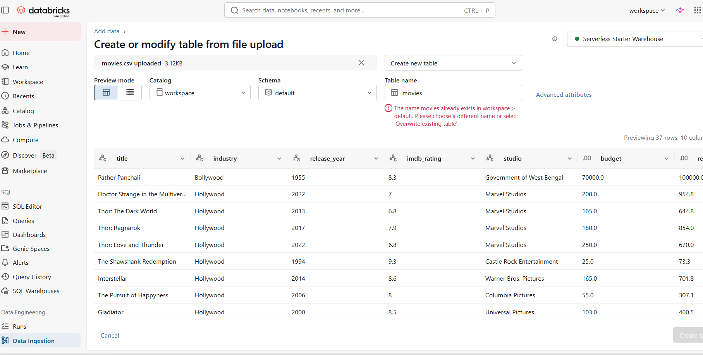
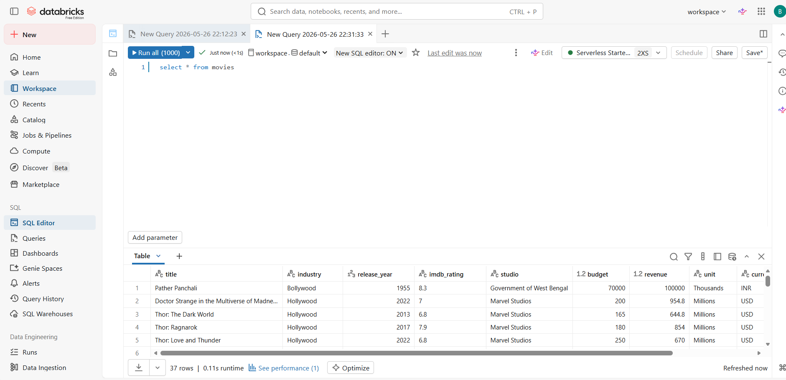
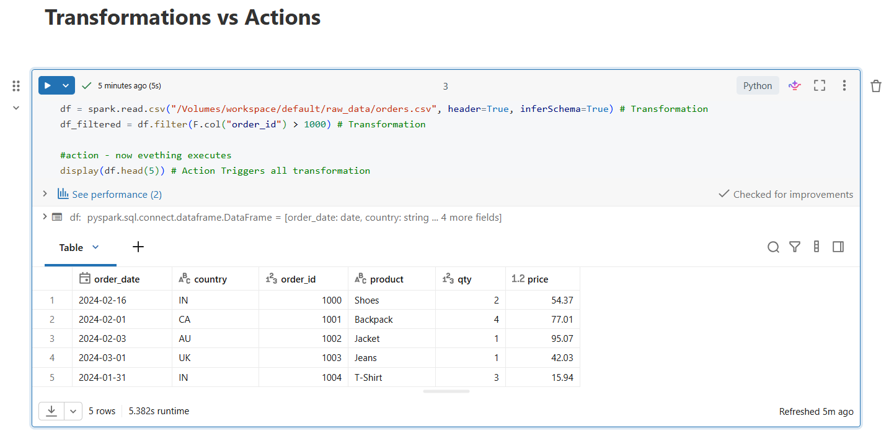

# Apache Spark and Hadoop

hadoop was introduced for distributed computing, but had serveral issue like disk heavy and slow.and later spark is introduced by apmlab

spark is distributed computing, much faster than hadoop and in-memory distributed computing.

To run a spark we have two options,

- self hosted - download spark / install via pipy / install via Docker
means we have do manage spark clusters and monitoring and scale up/down of clusters

- managed service - databricks is managed service means all spark/infra management hanldled by databricks 

NOTE: The databricks is found by the people who found the spark , they are know as Berkley mafia.

# Databricks free edition

## first step 

1.setup done in databrics free edition, in upload insetion file uploaded movies.csv file as table in workspace.default

2.Queried table as sql





### Transformations vs Actions



### Lazy Execution

it is part of special part of spark, that know how to execute the transformations/tasks effieciently

consider we have 3 operations on filters and selects required coolumns and at the end selects top 5 records

```spark
df = spark.table("movies")
df1 = df.filter(F.col("order_id")>1000)
df1 = df1.select("order_id")
display(df1.head(5))
```

it know how to execute the flows, example it actually require 5 records so it start from that and it consume less memory on disk
that is huge advantage of this spark, and also it is fault tolerant

Note: Lazy Evaluation build DAG( Directed Acyclic graph ) so it builds the flow of execution of each tasks.


