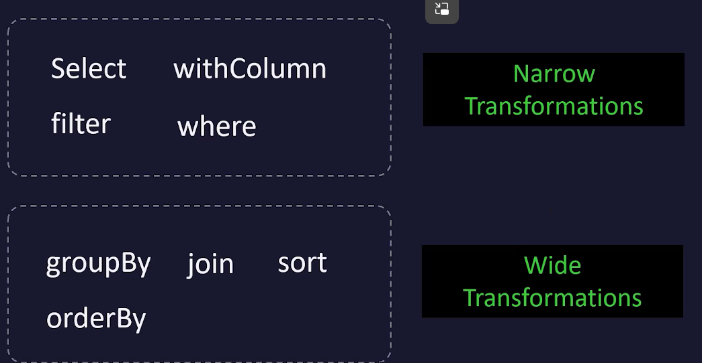
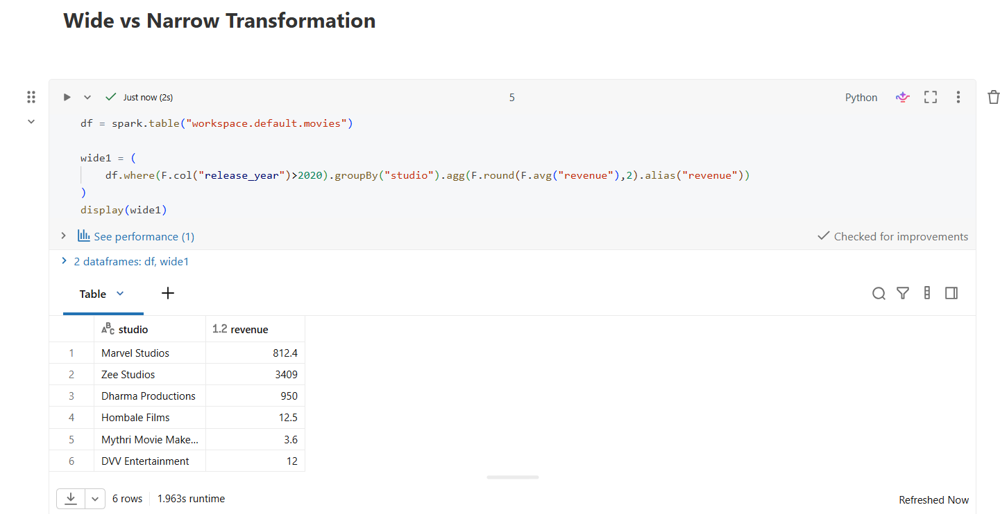
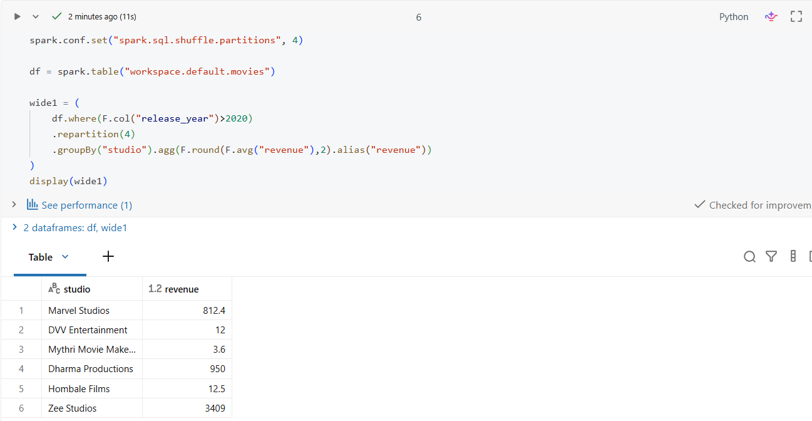
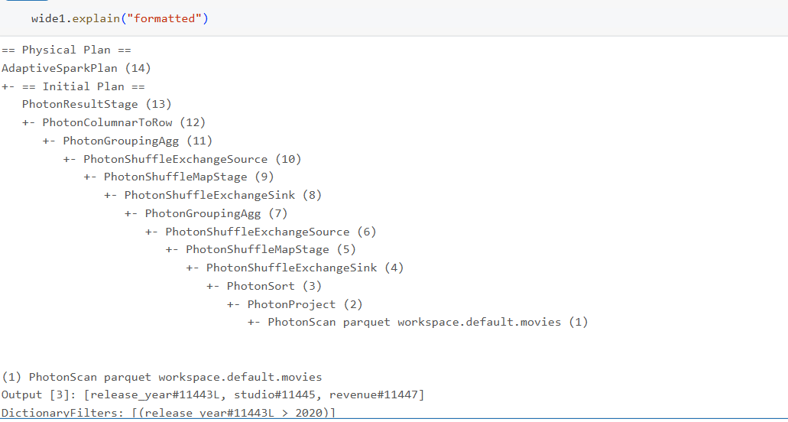
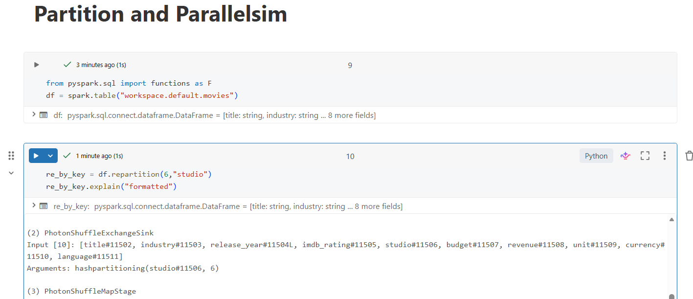
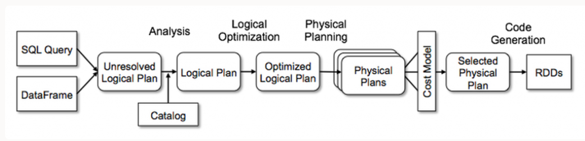
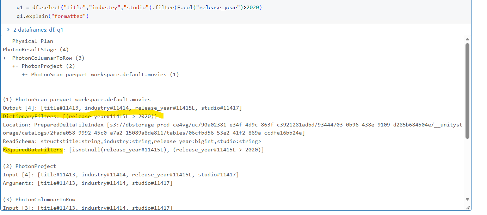
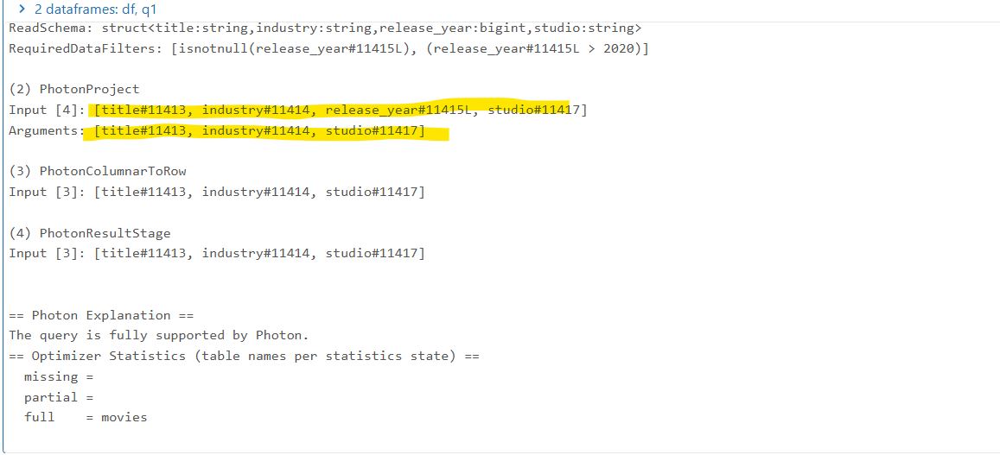
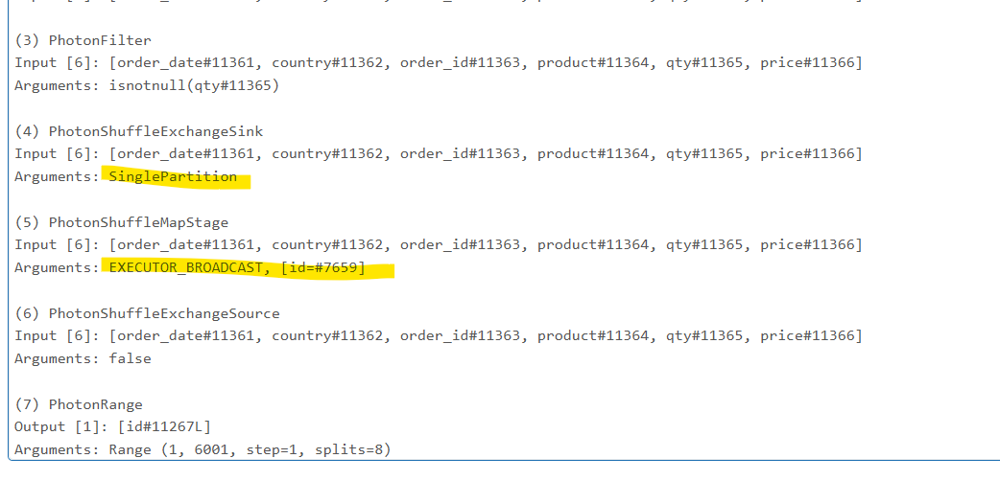
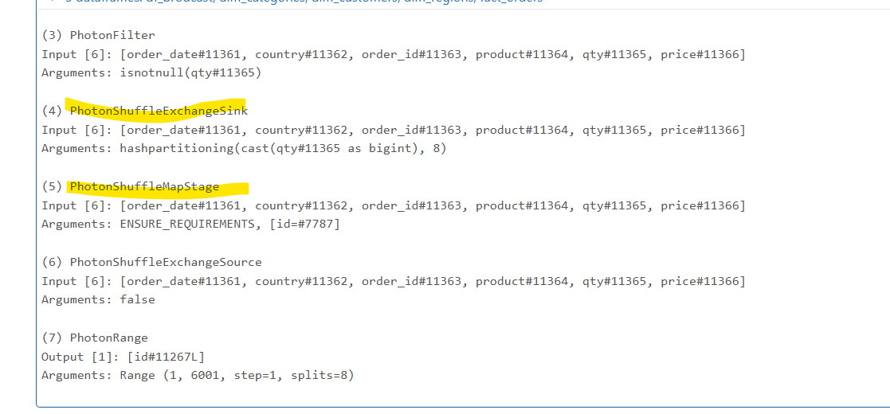

# Apache Spark and Hadoop

hadoop was introduced for distributed computing, but had serveral issue like disk heavy and slow.and later spark is introduced by apmlab

spark is distributed computing, much faster than hadoop and in-memory distributed computing.

To run a spark we have two options,

- self hosted - download spark / install via pipy / install via Docker
means we have do manage spark clusters and monitoring and scale up/down of clusters

- managed service - databricks is managed service means all spark/infra management hanldled by databricks 

NOTE: The databricks is found by the people who found the spark , they are know as Berkley mafia.

# Databricks free edition

## first step 

1.setup done in databrics free edition, in upload insetion file uploaded movies.csv file as table in workspace.default

2.Queried table as sql


# Spark Internals

### Transformations vs Actions


### Lazy Execution

it is part of special part of spark, that know how to execute the transformations/tasks effieciently

consider we have 3 operations on filters and selects required coolumns and at the end selects top 5 records

```spark
df = spark.table("movies")
df1 = df.filter(F.col("order_id")>1000)
df1 = df1.select("order_id")
display(df1.head(5))
```

it know how to execute the flows, example it actually require 5 records so it start from that and it consume less memory on disk
that is huge advantage of this spark, and also it is fault tolerant

Note: Lazy Evaluation build DAG( Directed Acyclic graph ) so it builds the flow of execution of each tasks.

### Narrow Transformations vd wide Transformations

Examples process of narrow and wide,



example of wide transformation below,



wide transformation triggers the shuffle operation which involves disk and network costlier in terms of performance.





### Partitions and Parallelism

repartition

```spark
from pyspark.sql import functions as F
df = spark.table("workspace.default.movies")

re_by_key = df.repartition(6,"studio")
re_by_key.explain("formatted")
```



coalesce()

```spark
df.coalesce(6)
```

means reduces the partition, only reduces never increases
this helps to avoid full shuffles (minimize the data movements) and eliminates too many partitions

### Catalyst Optimizer,Predicate Pushdown and Column Pruning

Catalyst Optimizer built in query optimizer, spark's rule based engine that automatically re-writes queires for better performance without altering result.



```spark
from pyspark.sql import functions as F

df = spark.table("workspace.default.movies")

q1 = df.select("title","industry","studio").filter(F.col("release_year")>2020)
q1.explain("formatted")
```

predicate pushdown:

in planning it pushes the filter as close to source , so that will not read the unnecessary data



Column Pruning:

it choose the required columns for output and used for operations such as filters



predicate pushdown and Column Pruning are rule based optimization

Note: there are other features of catalyst Optimixer, example Rule-based optimization, cost based optimization and code generation

for costbased- optimization there is an example like Brodcast joins or shuffle joins act based on logics.

## Join Stratergies

- Broadcast Hash join
- Shuffle Hash join
- Sort-Merge join

### Broadcast Hash join:

the single small table is brodcasted to multiple nodes, so that shuffiling the data will minimized and be faster in processing the joins



### Shuffle Hash join

the shuffle hash, will map the respecting repartions, eg: related customer id in diffrent nodes, customer_id = 1 then each node contains same id with two tables, by this it will optimzed will not wait or shuffle from diffrent node



# Data Skew

When data has uneven distribution or partition, so work is evenly distibuted so work is'nt balanced among clusters.

## straggler task:

it means consider we have an example:

df_grouped = customer_df.group_by("region_id")
print(df_grouped.count())

so above will do group by region and taking its count, what if first region contains 10 records and region 2 and 3 contains 1 records, so it is processed by NodeA, NodeB and NodeC.

finally Node A have more work, in terms of distribution system it is know as Straggler Task.

## Skew mitigation Problem

- Salting
- Broadcast
- Preaggregation

# Adaptive Query Execution (AQE)

diffrence b/q Catalyst and AQE id Catalyst is static Optimization and AQE is runtime Optimization.

- AQE hanles the Data Skew and distributes the data evenly in partitions and complete the job done in runtime

- it handles mutiple small partitions and implement coalese and complete the job.

- automatic join selection.